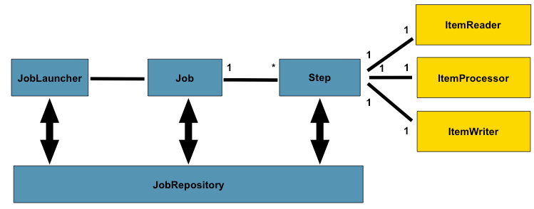

# demo-spring-batch-rsi
Quick demo to use Reactive Streams Ingestion (RSI) library as an ItemWriter in Spring Batch

In this demo we create a simple job with only one step. As depicted in the picture the step will use a an ItemReader, process the record and then persist it using an ItemWriter. The configuration of the job can be visualized in [BatchConfiguration.java](./src/main/java/com/oracle/rsi/demospringbatch/BatchConfiguration.java).

The ItemReader is an out-of-the-box FlatFileItemReader provided by Spring Batch. It reads records from customer.csv and maps each line to a [Customer.java](./src/main/java/com/oracle/rsi/demospringbatch/Customer.java) record (a simple POJO).

The ItemProcessor implemented in [CustomerItemProcessor.java](./src/main/java/com/oracle/rsi/demospringbatch/CustomerItemProcessor.java) is for educational purposes. It maps a Customer into a new Customer (it could have been mapped into a complete different entity) upper-casing the values.

The ItemWriter is where we integrate the Reactive Streams Ingestion (RSI) library. The [RSIItemWriter.java](./src/main/java/com/oracle/rsi/demospringbatch/RSIItemWriter.java) class implements the ItemWriter interface allowing to be hooked into the job. Overriding the 'write' method the class uses RSI to stream records into the database. The Customer class has the annotations to map the fields into the columns of the target database.

To execute this demo you just have to:
- Create the metadata used by Spring Batch defined in [metadata.sql](./metadata.sql).
- Define the location of the metadata in [application.properties](./src/main/resources/application.properties).
- create the table in the target database defined in the Customer class. 
- Define the location of the target database in [BatchConfiguration.java](./src/main/java/com/oracle/rsi/demospringbatch/BatchConfiguration.java) (in the ItemWriter).
- Build the demo with maven clean install.
- Execute it with java -jar target/demo-spring-batch-0.0.1-SNAPSHOT.jar.